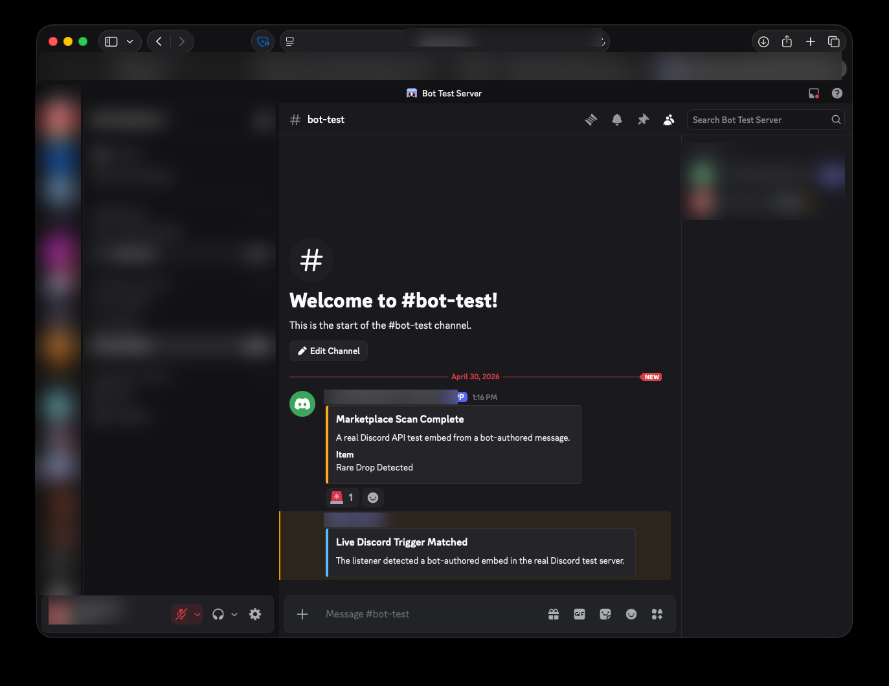

# Discord Embed Trigger Bot

## Overview

Portfolio-ready Discord bot for a common server automation gap: listening to embeds posted by third-party bots and responding when configured phrases appear. It supports multiple independent triggers, each with its own source bot id, phrase, reply embed, role ping, reaction emoji, and channel allowlist.

This project was built to match a real freelance brief for a "multi-trigger embed listener" where the critical requirement is that bot-authored messages must be processed, not ignored.



## Business Problem

Many off-the-shelf Discord bots can react to user messages, but they often ignore other bots by default. Server owners who rely on market bots, game bots, alert bots, or webhook-style relay bots need automation that watches those embeds and produces server-specific follow-up actions.

## Solution

The bot listens to Discord `messageCreate` events, filters messages from configured bot ids, scans embed title, description, and field values case-insensitively, then performs the configured actions in the same channel:

- sends a custom embed response
- pings a configured role
- reacts to the original embed
- respects per-trigger channel allowlists

Admin configuration is handled by Discord slash commands so new triggers can be added without editing code or redeploying.

## Features

- `/trigger add` to create or replace a trigger
- `/trigger edit` to update an existing trigger
- `/trigger remove` to delete a trigger
- `/trigger list` to inspect configured triggers
- `/status` to check runtime state
- Admin role restriction through `ADMIN_ROLE_ID`
- Single-server deployment model through `GUILD_ID`
- JSON persistence for simple cloud hosting and easy backups
- Unit tests for matching behavior and config persistence

## Tech Stack

- Node.js
- discord.js v14
- JSON file storage
- Node built-in test runner

Node.js was chosen because `discord.js` has mature slash-command and Gateway support, making deployment on Railway, Render, or Fly.io straightforward.

## Project Structure

```text
src/
  commands.js            Slash command definitions and helpers
  config.js              Environment variable loading
  index.js               Discord client and event handlers
  matcher.js             Embed text extraction and trigger matching
  register-commands.js   Guild slash-command registration
  store.js               Runtime trigger persistence
test/
  matcher.test.js
  store.test.js
data/
  triggers.example.json
sample_output/
  demo-trigger-transcript.md
```

## Local Setup

```bash
npm install
cp .env.example .env
```

Fill in `.env`:

```bash
DISCORD_TOKEN=your-bot-token
CLIENT_ID=your-application-client-id
GUILD_ID=your-server-id
ADMIN_ROLE_ID=role-allowed-to-manage-triggers
TRIGGER_STORE_PATH=./data/triggers.json
```

Required Discord Developer Portal settings:

- bot token enabled
- `MESSAGE CONTENT INTENT` enabled
- bot invited with permissions to read messages, send messages, use slash commands, mention roles, and add reactions

## Register Slash Commands

```bash
npm run register
```

This registers guild-scoped commands for the configured server.

## Run

```bash
npm start
```

## Test

```bash
npm test
```

The tests run without a Discord token and verify the important freelance-brief behavior: bot-authored embeds are accepted, title/description/field values are scanned, source bot ids are enforced, and channel allowlists are respected.

## Example Trigger

```json
{
  "id": "market-alert",
  "sourceBotId": "111111111111111111",
  "phrase": "rare drop detected",
  "response": {
    "title": "Rare Drop Alert",
    "description": "A matching third-party bot embed was detected. Check the original post before acting.",
    "color": 5814783
  },
  "pingRoleId": "222222222222222222",
  "reactionEmoji": "🚨",
  "channelAllowlist": ["333333333333333333"],
  "enabled": true
}
```

The same trigger can be created through `/trigger add` in Discord.

## Deployment Notes

Recommended hosting: Railway.

Reason: this bot is a long-running worker, does not need inbound HTTP traffic, and Railway makes environment variables and restart logs simple for a client-owned deployment.

Deployment steps:

1. Create a new Railway project from the GitHub repo.
2. Add the `.env` values as Railway variables.
3. Set the start command to `npm start`.
4. Run `npm run register` once from a local machine or Railway shell after changing command definitions.
5. Confirm `/status` works in the target Discord server.

## Handover Checklist

- Source code delivered in the client-owned repo
- Discord application and bot token remain in the client's account
- Runtime variables documented in `.env.example`
- Slash commands registered to one server
- Admin role set through `ADMIN_ROLE_ID`
- Trigger config stored at `data/triggers.json` on the host
- Client shown how to add, edit, remove, and list triggers

## Proposal Snippet

Similar project: I have a working Discord embed-listener bot that watches third-party bot embeds, scans title/description/field values case-insensitively, and responds with configurable embeds, role pings, reactions, and channel allowlists. Stack: Node.js + discord.js because it is mature for Gateway events and slash commands. I can deliver this as a fixed-scope bot with Railway deployment, setup docs, and post-launch tweaks.
